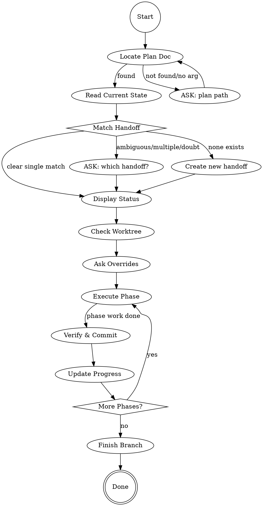

# CONTINUE MULTI-PHASE PROJECT



## NODE DETAILS

**locate**: Search `docs/plans/` then `~/.claude/plans/`. Path provided → read directly.

**read**: Extract from plan: project name, completed phases (checked Progress), next phase, key files, verification steps.

**match**: Plan doc = source of truth. Handoffs pollute across sessions.
- Verify: title contains project name, refs match Key Files, phase aligns with Progress
- Edge "ambiguous": multiple matches, ambiguous title, refs span projects, ANY doubt
- Edge "none exists": Output `HANDOFF: [Project Name] Phase [N]`

**status**: Display compact summary:
```
## [Project Name]
Completed: [x] Phase 0 - `hash` | [x] Phase 1 - `hash`
Next: Phase 2 - [Name] ([goal])
Files: path/file.cpp | Handoff: [hf-XXX]
```

**worktree**: If exists, run `git status` + `git log --oneline -3`. Report uncommitted/divergence.

**overrides**: AskUserQuestion: None | Skip TDD | Extra review | Custom

**execute**: If `superpowers:executing-plans` available → delegate. Else follow plan steps directly.

**verify**: Run tests/verification from plan. If `superpowers:requesting-code-review` available → use for significant changes.

**update**: Commit `feat(scope): phase N desc`. Update Progress: `- [x] Phase N: [Name] - \`hash\` (date)`. Mark todo complete.

**finish**: If `superpowers:finishing-a-development-branch` available → delegate. Else: full tests, ask merge/PR/keep, cleanup worktree.

## HANDOFF MATCHING RULES

| Situation | Action |
|-----------|--------|
| Explicit path provided | Trust plan, ignore handoff suggestions |
| Single clear match | Resume (verified title+refs+phase) |
| Multiple/ambiguous | **ASK** via AskUserQuestion |
| None exists | Create new handoff |
| Any doubt | **ASK** - never auto-select |

## DEFAULTS
Delegation: main coordinates, agents implement | TDD: backend=yes, UI=skip | Reviews: proportional | Commits: 1/phase
