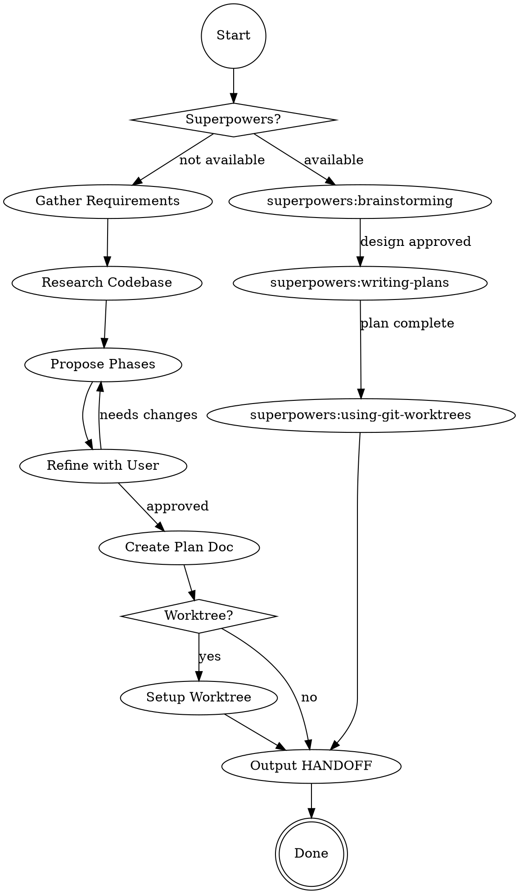

# NEW MULTI-PHASE PROJECT



## NODE DETAILS

**check_super**: Test if `superpowers:brainstorming` skill available. If yes, delegate entire flow to superpowers chain.

**requirements**: If user hasn't described feature, ask: "What feature would you like to build?"

**research**: Launch Explore agents for: similar patterns, architecture, testing conventions, existing infrastructure.

**propose**: AskUserQuestion with phase breakdown. Each phase ≈ 1 commit. Phase 0 = foundation. Include goal, deliverables, verification. Typically 3-6 phases.

**refine**: Iterate based on feedback. Clarify: priorities, patterns, testing requirements.

**plan**: Write to `docs/plans/[project-name]-plan.md`:
```markdown
# [Feature Name]
## Overview
[1-2 sentences]
## Phases
### Phase N: [Name]
**Goal**: [What] | **Deliverables**: [List] | **Verification**: [How]
## Progress
- [ ] Phase 0: [Name]
## Key Files
- `path/file.cpp` - [role]
```

**worktree_setup**: Check CLAUDE.md for conventions. Run: `git worktree add -b [branch] ../[project]-[feature] main` + init scripts.

**handoff**: Output `HANDOFF: [Project Name]`. Inform user: plan location, worktree path (if created), use `/continue` to resume.

## PLAN LOCATION
Prefer `docs/plans/` (in project, versioned). Use `~/.claude/plans/` only if project disallows.

## DEFAULTS
Delegation: main coordinates, agents implement | TDD: backend=yes, UI=skip | Reviews: proportional | Commits: 1/phase
